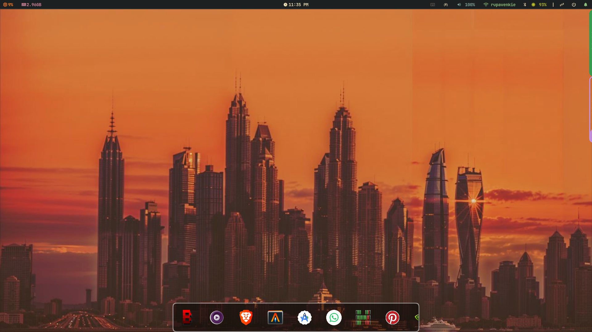
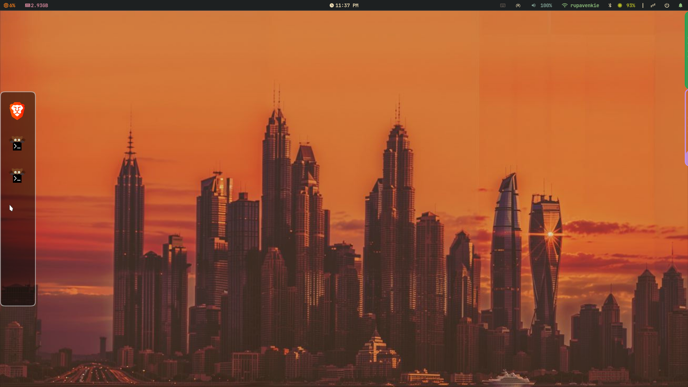

# App Launcher

The `app_launcher` is a Niri + Wayland layer-shell application that can be used to launch apps and focus on the opened apps on the workspace.

### Introduction

Hey, so I got inspired by `way-edges`, and an idea popped up into my head: can I make a dock that pops up like `way-edges` do? At the same time, I was trying to learn Rust, so I decided to take up this project. Currently, I'm taking a break from this. I might look back at this in the future.

### Demo

---

### Core Demo

## 

### Application Dock



### Window Switcher



## Till Now

This project uses `guido` to interact with Wayland, and `niri_ipc` to interact with `niri-wm`.

1. Search for apps (`/usr/share/applications`, `~/.local/share/applications`).
2. Get their icons (`linicons`, `freedesktop_icons`).
3. Open app using `niri_ipc` (`Action::SpawnSh`).
4. Store the frequently accessed app in a cache file ensuring that no app dominates and always is first (simple but elegant algo).
5. Mapped the vertical scroll to horizontal offset in App dock (it was work around, i just added reactive padding - i cant find any offset property).
6. Added GUI and enter animations (surface size changes dynamically).
7. Added app-launcher dock.
8. Fetched all active apps using `niri_ipc` (`Request::Windows`).
9. Focus logic using `niri_ipc` (`Request::FocusWindow(id)`).
10. Added GUI and reused `NiriApp` for icons.
11. Added active-apps dock.

## TODO

1. Optimize the performance and RAM usage by loading few apps at a time.
2. Use `Arc<HashMap<Arc<NiriApp>>>` to eliminate the sorting.
3. Cache the `NiriApps` in `~/.cache/app-launcher/niri-apps.cache`, and only confirm them at the time of open.
4. Add a way to interact with app using CLI.

## Usage

Build from source using:

```bash
git clone https://github.com/Coffee7Cup/app-drawer-rs.git
cd app-drawer-rs

cargo build --release

./target/release/app-launcher
```

## Today 20/06/2026

Some of the features in <https://malpenzibo.github.io/guido> are not up to date, like `.children_dyn(items, key_fn, view_fn) - Dynamic list`. Refer to docs.rs.

Guido is amazing, thanks malpenzibo, its great work!. ^\_^
